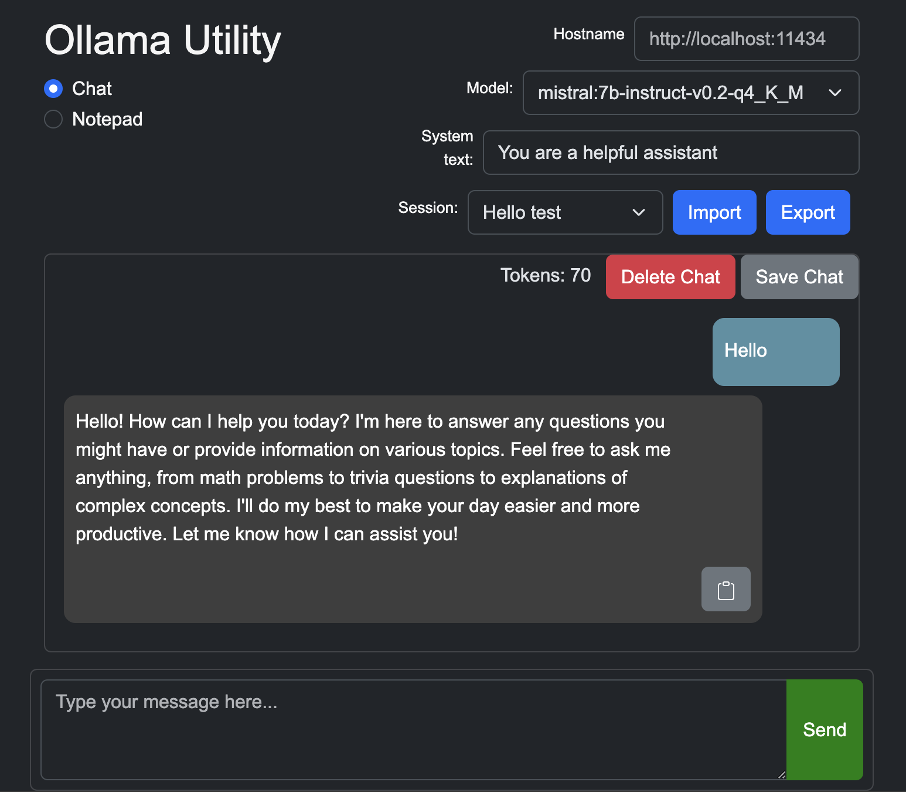
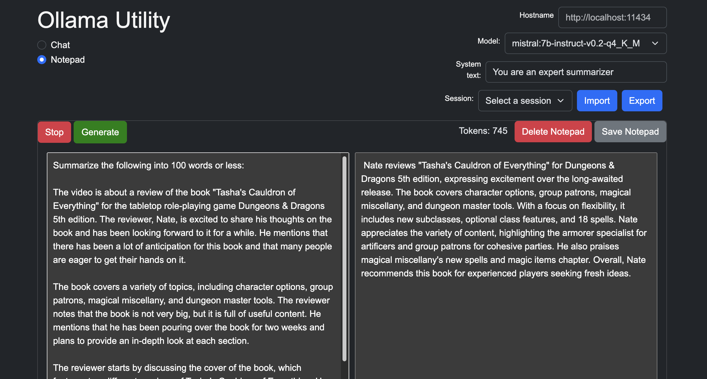

# ollama-utility

Forked from [ollama-ui](https://github.com/ollama-ui/ollama-ui)

Just a simple HTML UI for Ollama

## Usage

```
git clone https://github.com/ismaelc/ollama-utility
cd ollama-utility
make

open http://localhost:8000 # in browser
```

## Screenshots

| Chat | Notepad |
| --------------------- | --------------------- |
|  |  |

## Pull latest
```
git pull origin main
```

## Kill ollama serve
```
pkill -f "ollama serve"
```

## Kill process hogging port 8000
```
lsof -ti:8000 | xargs kill
```