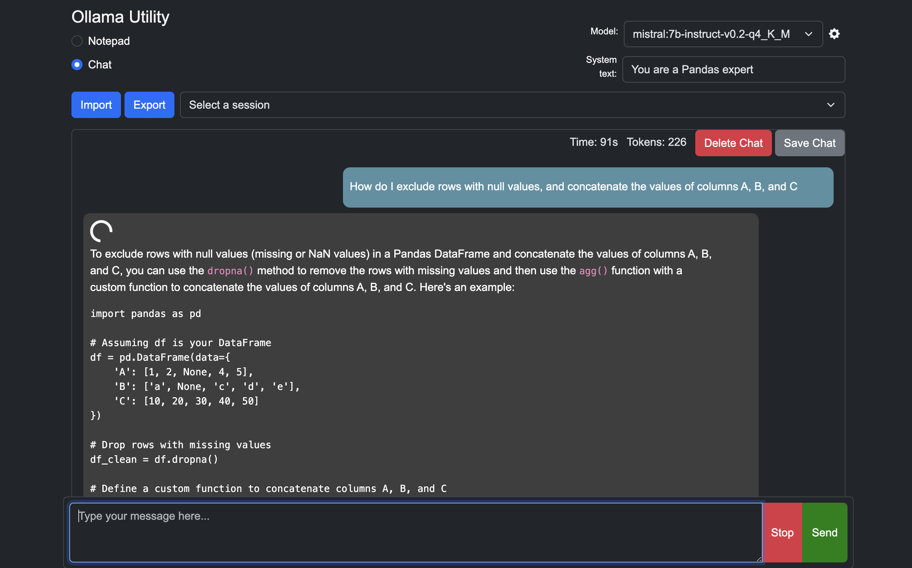

# ollama-utility

Forked from [ollama-ui](https://github.com/ollama-ui/ollama-ui)

A simple HTML UI for Ollama


| Chat | Notepad |
| ---- | ------- |
|  |  |

## Setup/Usage

#### Mac/Linux (With Git)

```bash
git clone https://github.com/ismaelc/ollama-utility
cd ollama-utility
make
(open http://localhost:8000) # Open in browser
```

#### Mac/Linux (Without Git)

Download and extract the utility directly:

```bash
curl -L https://github.com/ismaelc/ollama-utility/archive/main.zip -o ollama-utility.zip
unzip ollama-utility.zip
cd ollama-utility-main
make
(open http://localhost:8000) # Open in browser
```

Or, if `curl` is not available, use `wget`:

```bash
wget https://github.com/ismaelc/ollama-utility/archive/main.zip -O ollama-utility.zip
unzip ollama-utility.zip
cd ollama-utility-main
make
(open http://localhost:8000) # Open in browser
```

#### Windows

Download the Ollama Windows client from https://ollama.com/download/windows

Open PowerShell as Administrator and run:

```powershell
# Download and run GetOllamaUtility.ps1
Invoke-WebRequest "https://raw.githubusercontent.com/ismaelc/ollama-utility/main/windows/GetOllamaUtility.ps1" -OutFile "GetOllamaUtility.ps1"
Set-ExecutionPolicy RemoteSigned -Scope CurrentUser -Force
.\GetOllamaUtility.ps1

# Download and run RunOllamaUtility.ps1
Invoke-WebRequest "https://raw.githubusercontent.com/ismaelc/ollama-utility/main/windows/RunOllamaUtility.ps1" -OutFile "RunOllamaUtility.ps1"
.\RunOllamaUtility.ps1

# Open in browser
(open http://localhost:8000)
```

If a message indicates you need Python, simply type "Python" in the same Terminal to open up Microsoft Store to download/install Python.

## Maintenance Commands

#### Update to latest version:

```bash
git pull origin main
```

...or, if Git is not installed, re-download the latest version as described above.

#### Get new models:

Go to https://ollama.com/library and click on a model. Click `Tags`
```
ollama pull gemma:7b-instruct-q4_K_M
```
...refresh http://localhost:8000 to update the model dropdown selection

#### Terminate running ollama service:

```bash
pkill -f "ollama serve"
```

#### Free up port 8000:

```bash
lsof -ti:8000 | xargs kill
```

...or in Powershell...
```bash
Get-NetTCPConnection | Where-Object { $_.LocalPort -eq 8000 } | Select-Object -ExpandProperty OwningProcess | ForEach-Object { Stop-Process -Id $_ -Force }
```